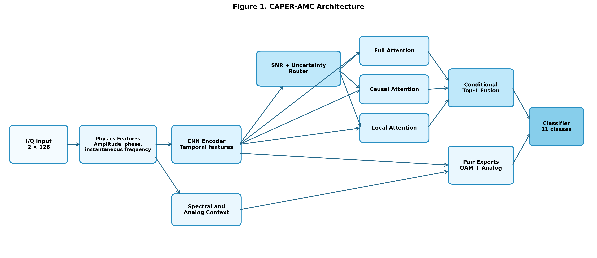
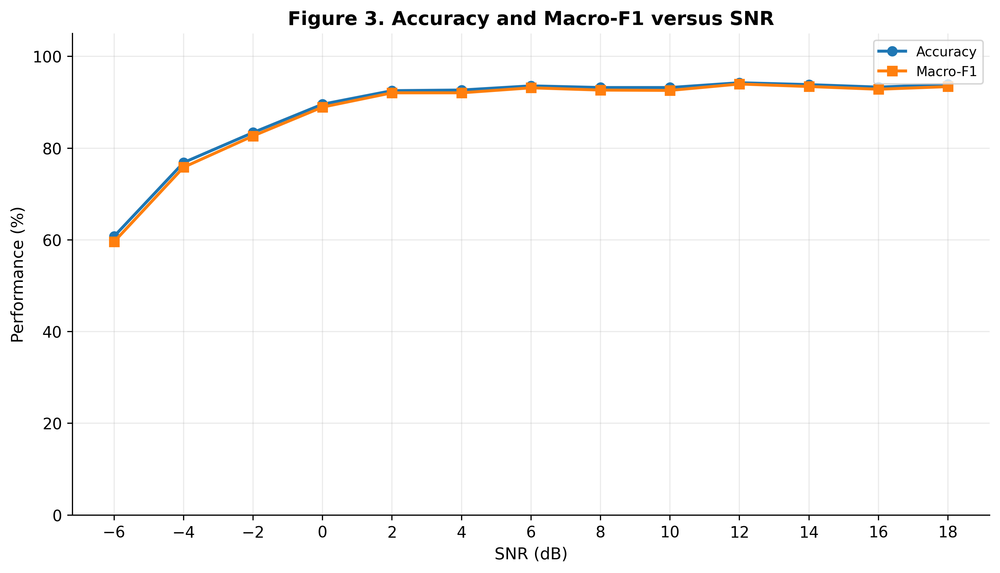
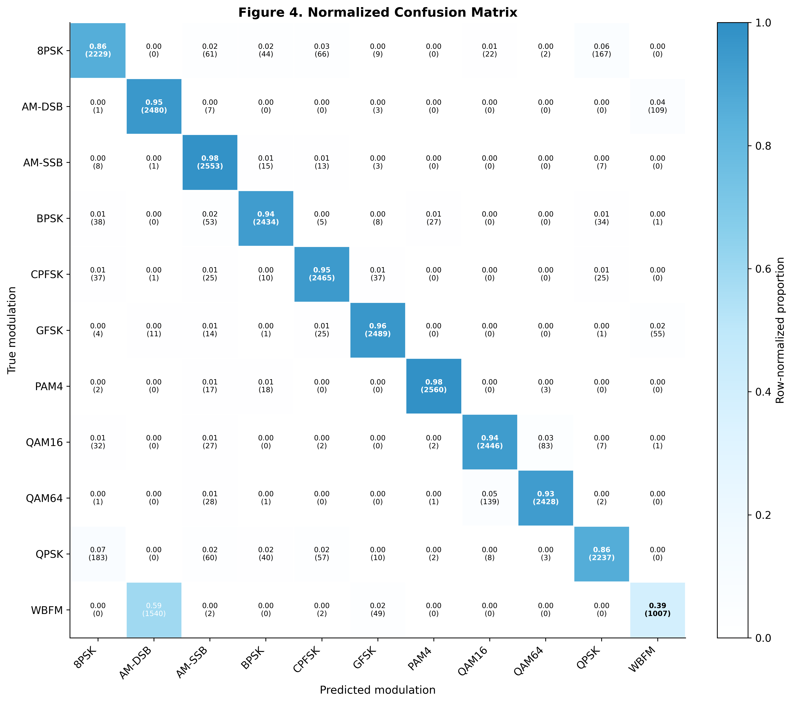
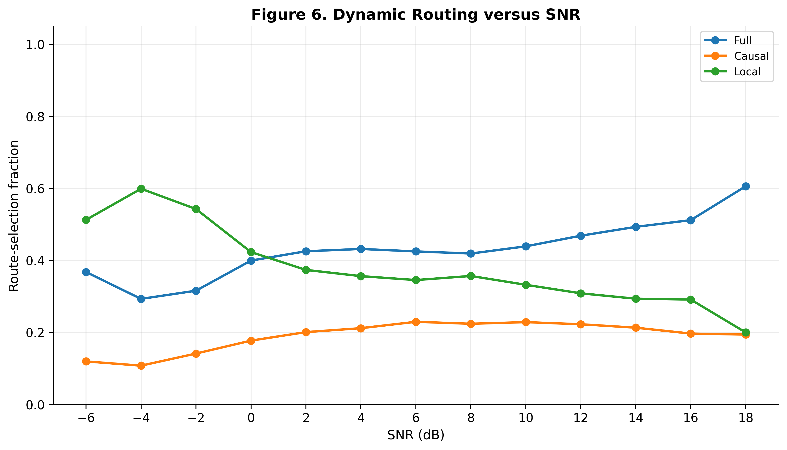

# CAPER-AMC

**Cost-Aware Physics-Enhanced Dynamic Attention Routing for Automatic Modulation Classification**

CAPER-AMC is an experimental Automatic Modulation Classification (AMC) framework for RadioML I/Q signals. The model combines a physics-informed signal front-end with conditional Top-1 attention routing so that different samples can use different attention paths.

This repository contains the complete Colab notebook, trained checkpoint, evaluation outputs, CSV tables, and paper-quality figures from the high-accuracy experiment.

## Main results

| Metric | Result |
|---|---:|
| Final test accuracy | **88.56%** |
| Raw TTA test accuracy | 88.54% |
| Single-view test accuracy | 88.48% |
| Macro F1 | **0.8801** |
| Expected Calibration Error (ECE) | 0.0112 |
| SNR estimation MAE | 1.90 dB |
| Model parameters | 1,060,337 |
| Conditional inference time | 0.0359 ms/sample |

The experiment used **143,000** RadioML samples from SNR **-6 dB to 18 dB**, divided into **85,800 training**, **28,600 validation**, and **28,600 test** samples.

> **Research status:** This is a prototype experiment. For a final paper claim, repeated-seed experiments and a fresh held-out test set are recommended.

## CAPER-AMC architecture



The high-accuracy configuration uses:

- Physics-enhanced I/Q feature processing
- Spectral and analog context
- Conditional **Top-1** dynamic routing
- Full, causal, and local attention routes
- Pair experts for difficult modulation groups
- EMA-based model selection
- Test-time augmentation (TTA)
- Temperature scaling for calibration

## Performance vs. SNR



## Confusion matrix



## Dynamic routing behavior



## Dataset

The notebook is designed for **RML2016.10a**. The raw dataset is **not included** in this repository.

The 11 modulation classes used are:

`8PSK`, `AM-DSB`, `AM-SSB`, `BPSK`, `CPFSK`, `GFSK`, `PAM4`, `QAM16`, `QAM64`, `QPSK`, and `WBFM`.

For the supplied Colab notebook, place the dataset in Google Drive as:

```text
/content/drive/MyDrive/RML2016.10a_dict.pkl
```

The notebook filters the data to SNR values from **-6 dB through 18 dB**.

## Repository structure

```text
CAPER-AMC/
├── README.md
├── requirements.txt
├── .gitignore
├── notebooks/
│   └── CAPER_AMC_High_Accuracy_with_Paper_Figures.ipynb
├── results/
│   ├── caper_amc_high_accuracy_best.pth
│   ├── result_summary.json
│   ├── training_history.csv
│   ├── classification_report.csv
│   ├── normalized_confusion_matrix.csv
│   ├── snr_analysis.csv
│   ├── routing_mode_diagnostics.csv
│   └── ...
├── figures/
│   ├── figure_01_caper_amc_architecture.png
│   ├── figure_03_performance_vs_snr.png
│   ├── figure_04_normalized_confusion_matrix.png
│   ├── figure_06_dynamic_routing_vs_snr.png
│   └── ...
└── docs/
    └── UPLOAD_TO_GITHUB.md
```

## Run in Google Colab

1. Upload or clone this repository.
2. Put `RML2016.10a_dict.pkl` in your Google Drive root (`MyDrive`).
3. Open:

```text
notebooks/CAPER_AMC_High_Accuracy_with_Paper_Figures.ipynb
```

4. Select a GPU runtime in Colab.
5. Run the notebook cells in order.

The experiment configuration used in the supplied results includes:

- Seed: `42`
- Batch size: `384`
- Evaluation batch size: `768`
- Maximum epochs: `65`
- Learning rate: `2.5e-4`
- Weight decay: `5e-5`
- EMA decay: `0.9995`
- TTA views: `4`

## Install dependencies locally

```bash
pip install -r requirements.txt
```

The notebook contains Google Colab-specific Drive/file utilities, so Colab is the simplest environment for reproducing the full workflow.

## Saved model

The trained model checkpoint is available at:

```text
results/caper_amc_high_accuracy_best.pth
```

The checkpoint corresponds to the best single EMA model selected during the experiment. The recorded best epoch was **45**.

## Result files

The `results/` directory contains the main reproducibility outputs, including:

- Dataset split summary and manifest
- Training history
- Best model checkpoint
- Accuracy and route-usage curves
- Classification report
- Confusion matrix
- Accuracy by SNR
- Class-wise routing analysis
- Routing-mode diagnostics
- Final JSON experiment summary

The `figures/` directory contains PNG/PDF figures plus the CSV data used to produce many of the plots.

## Notes for research use

The included metrics describe the supplied experiment and checkpoint. If these results are used in a publication, report the exact data split and evaluation protocol, and use repeated independent runs when making statistical comparisons or final novelty/performance claims.
